<p align="center">
  
</p>

<h1 align="center">Git for Unity</h1>

<p align="center">
  Git внутри редактора Unity — для сцен, префабов и ассетов, а не только для текста.
</p>

<p align="center">
  <a href="LICENSE"></a>
  
  <a href="https://github.com/LatyninEugene/git-for-unity/releases"></a>
  <a href="https://github.com/LatyninEugene/git-for-unity/actions/workflows/ci.yml"></a>
</p>

<p align="center">
  <a href="README.md">English</a> · <b>Русский</b>
</p>

<p align="center">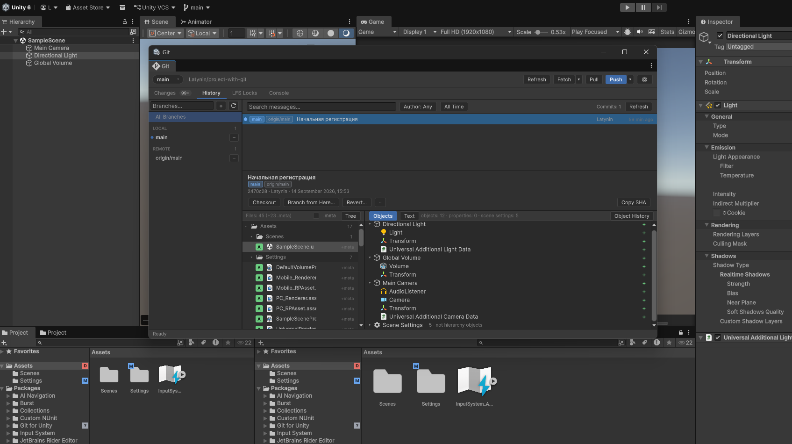</p>

Обычный git-клиент видит Unity-проект как текст: сцена — тысячи строк YAML, текстура — «бинарный файл
изменён», а забытый `.meta` всплывает, только когда проект открывает кто-то другой. Git for Unity
работает внутри редактора и видит проект так же, как ты: объекты, компоненты, свойства и то, как
ассеты выглядят на самом деле.

Работает с любым git-сервером. Возможности хостинга подключаются интеграциями; первая из них —
[GitLab](#интеграция-с-gitlab): merge request'ы, ревью с комментариями к объектам сцены и задачи.

- [Какие проблемы решает](#какие-проблемы-решает)
- [Интеграция с GitLab](#интеграция-с-gitlab)
- [Установка](#установка)
- [С чего начать](#с-чего-начать)
- [Документация](#документация)

## Какие проблемы решает

### «Diff сцены — 3000 строк YAML»

Сцены и префабы сравниваются объектами, а не строками: какой GameObject добавлен, удалён или
перемещён, какой компонент изменён и какое свойство — под теми же именами, что в инспекторе. Те же
метки появляются прямо в иерархии и инспекторе, так что изменение легко найти в открытой сцене.
Любое изменение можно открыть инспектором «было и стало» или сравнить с текущим состоянием сцены.

<p align="center">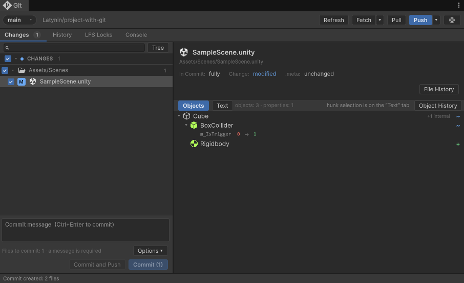</p>

<p align="center">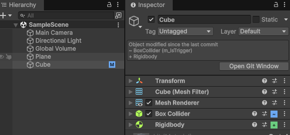</p>

### «Бинарный файл изменён — а что именно?»

Каждая версия ассета показывается так, как он выглядит: текстуры, материалы, меши и модели, звук,
анимации и контроллеры, Timeline, префабы, настройки сцены. Две версии можно сравнить рядом, шторкой,
переключением, наложением или маской разницы. В списках файлов — миниатюры, а **История ассета**
раскладывает все его версии на ленте.

<p align="center">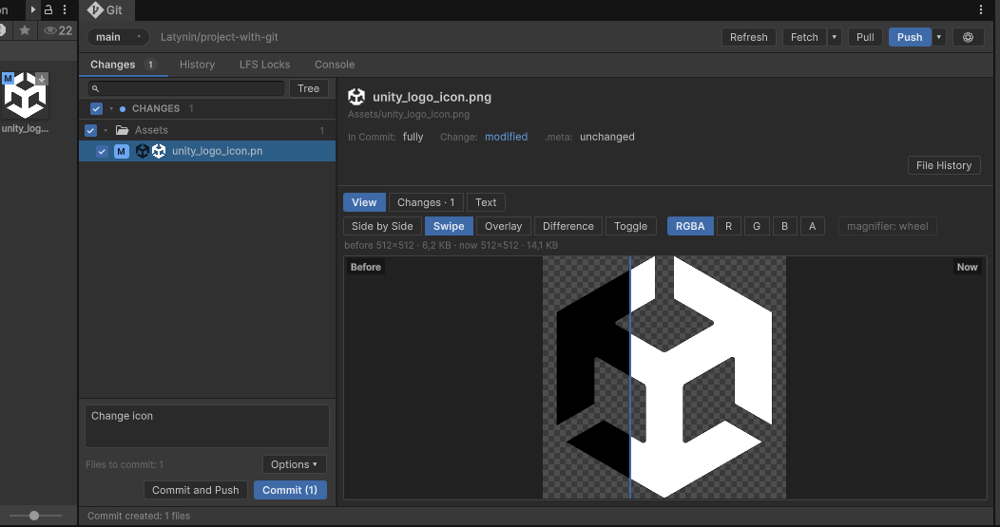</p>

<p align="center">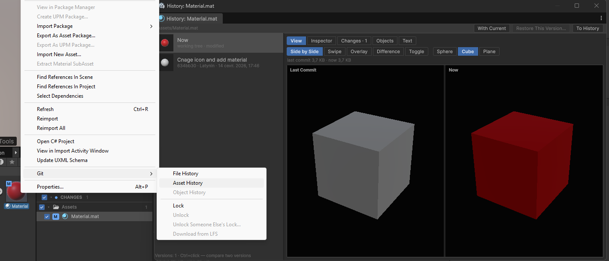</p>

### «Кто поменял этот объект и когда?»

Правой кнопкой по объекту в иерархии → **Git → Object History**. Окно покажет каждый коммит, в котором
менялся объект: какие компоненты добавлены и какие свойства изменились, кто и когда это сделал.

<p align="center">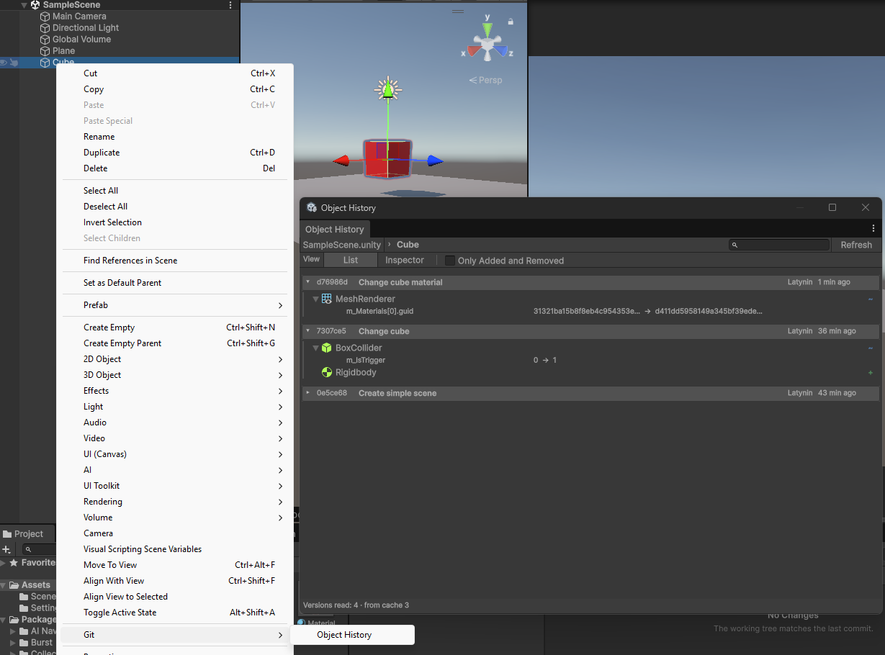</p>

Переключи вид на **Inspector** — и каждое изменение видно настоящими инспекторами: до и после коммита
или в сравнении с текущим состоянием. Любой компонент можно вернуть из этой версии, не откатывая всю
сцену. История компонента так же открывается из инспектора.

<p align="center">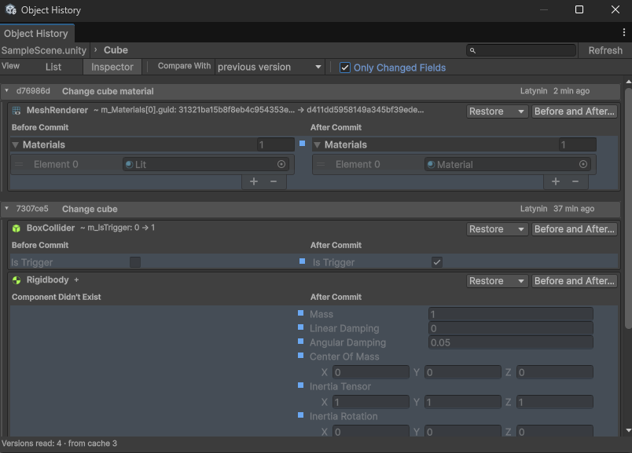</p>

### «Конфликт слияния»

Ветку можно слить прямо со вкладки «История».

<p align="center">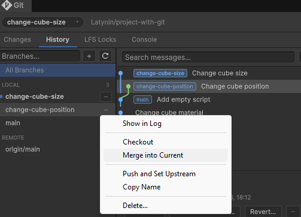</p>

Если обе стороны меняли одну сцену, вкладка «Изменения» покажет конфликт объектами и свойствами — что
именно столкнулось — и кнопку **Resolve…**.

<p align="center">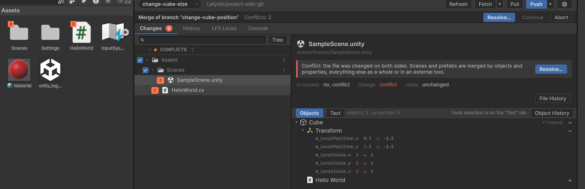</p>

Окно конфликтов раскладывает иерархию и инспектор в три колонки — моё, итог, их. Можно взять целый
объект или одно значение с любой стороны; то, что менялось только с одной стороны, берётся само. Итог
проверяется перед записью, резервная копия остаётся в `Library/LevGit/MergeBackups`. Текстовые файлы
решаются в том же окне, бинарные — выбором версии целиком.

<p align="center">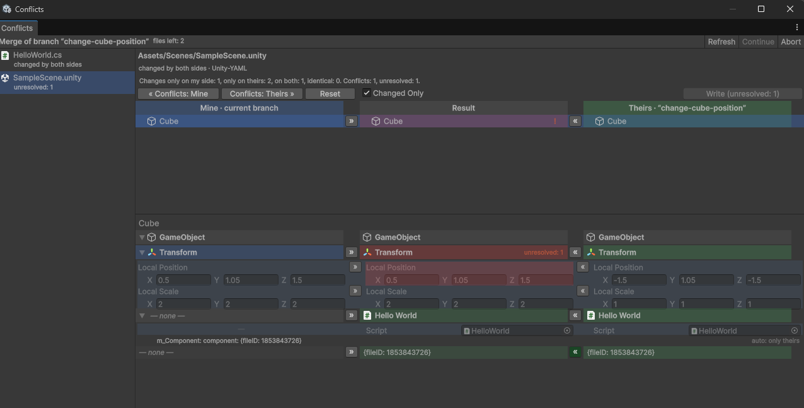</p>

### Свои типы ассетов

Для своих ScriptableObject и форматов файлов изменения можно описать своими словами и нарисовать
превью тремя небольшими классами — без регистрации. Подробнее — в разделе
[«Своё превью ассетов»](Packages/ru.lev.unity-git/README.ru.md#своё-превью-ассетов) и в примере
в Package Manager.

## Интеграция с GitLab

Всё, что команда делает вокруг merge request'а — ревью, обсуждение, слияние, задачи, — происходит в
том же окне, где делаются изменения, и сцены там тоже остаются объектами. Интеграция работает с
gitlab.com и с собственным GitLab.

### Подключение за минуту

Включается в **Project Settings → Git → Интеграции**; если remote похож на GitLab, страница сама
предложит её включить. Сервер и путь проекта берутся из git remote, их можно задать вручную — например,
если remote работает по SSH.

Токен API отдельный от учётных данных git для push: отзыв одного не ломает другое. Он хранится только
в системном хранилище учётных данных этого компьютера (Диспетчер учётных данных Windows, Secret Service
на Linux) — не в проекте и не в журнале. С той же страницы токен можно создать в GitLab с уже заполненными
названием и правами, проверить его пользователя, права и срок, выпустить новый взамен через API или отозвать.

Рабочий процесс команды — настройка проекта, а не решение пакета: кто может сливать из редактора, что
делать после слияния, шаблон имени ветки из задачи, целевая ветка, draft, squash и описание новых MR.

<p align="center">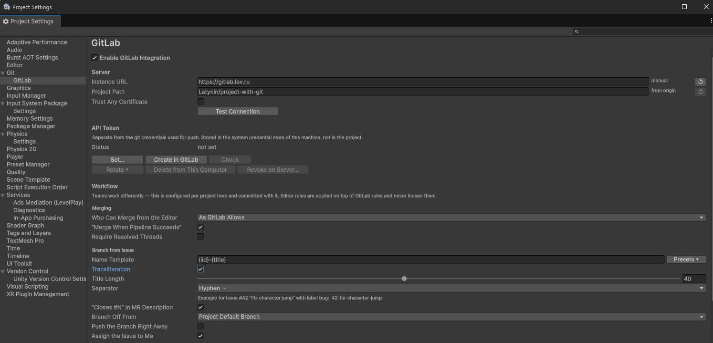</p>

### Задачи превращаются в ветки

Задачи отбираются так: назначенные мне, созданные мной, все открытые, закрытые. **Начать работу**
создаёт ветку по шаблону проекта — например, `42-fix-door-trigger` — или переходит на уже заведённую
и при желании назначает задачу на тебя. На ветке задачи merge request создаётся с `Closes #42`.

Новую задачу можно завести, не выходя из редактора, и приложить к ней снимок окна Game или Scene.

<p align="center">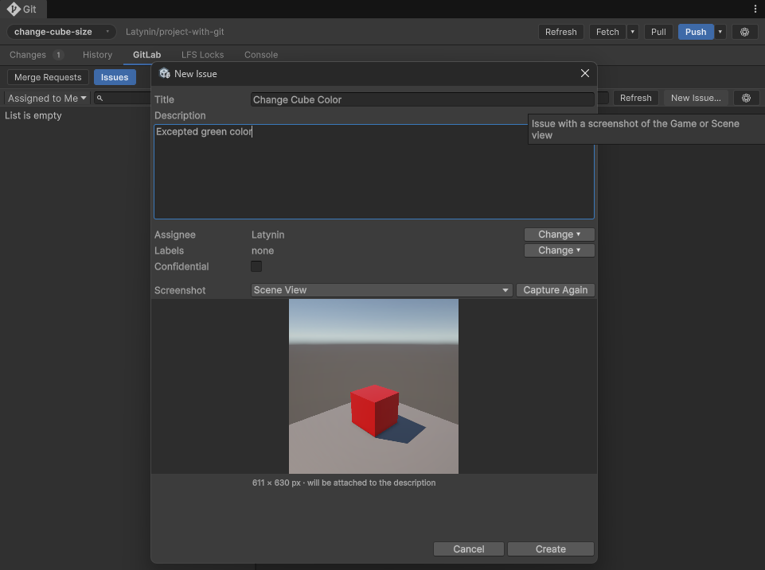</p>

<p align="center">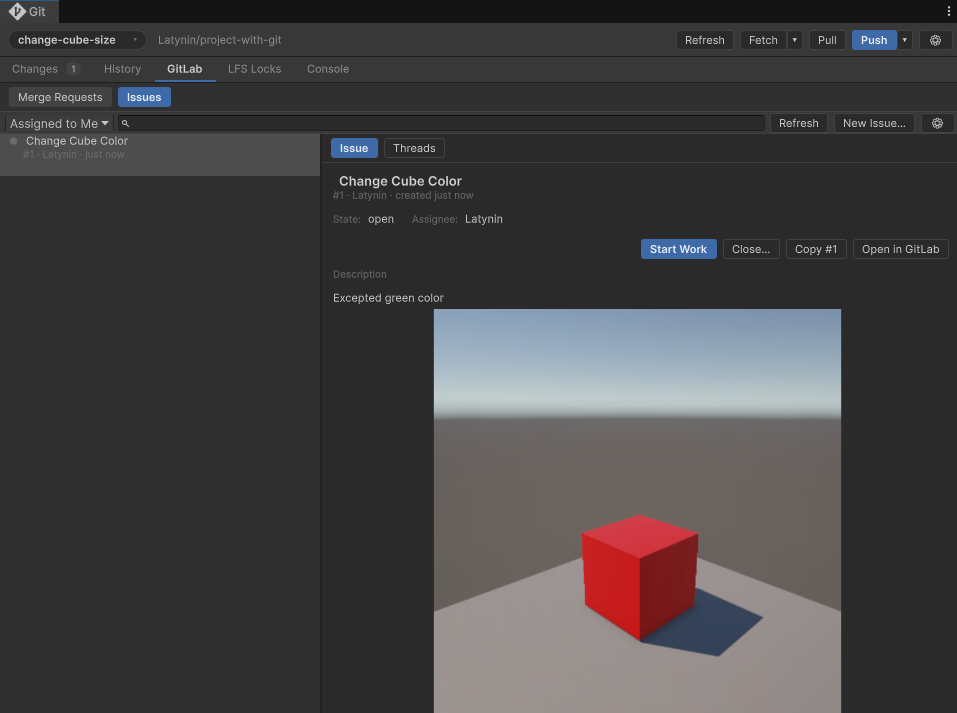</p>

<p align="center">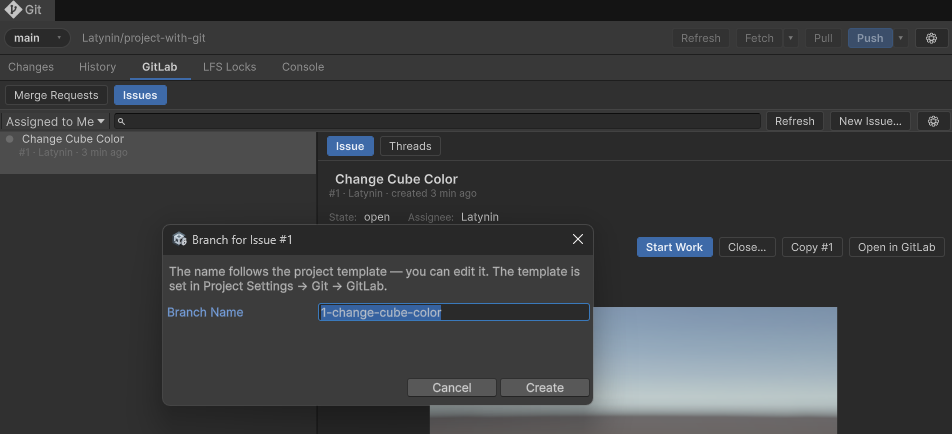</p>


### Merge request'ы

Вкладка **GitLab** показывает merge request'ы: мои, ждут моего ревью, все открытые, слитые, закрытые.
Карточка говорит, можно ли слить и почему нет, показывает одобрения и пайплайн. Перейти на ветку,
одобрить, слить или «слить, когда пайплайн пройдёт», сделать rebase на сервере, пометить draft, закрыть.
В журнале у веток с открытым MR — значок `!12`, который открывает его.

Новый merge request создаётся из текущей ветки — с исполнителем, ревьюерами, метками, draft и squash;
значения по умолчанию берутся из настроек проекта.

<p align="center">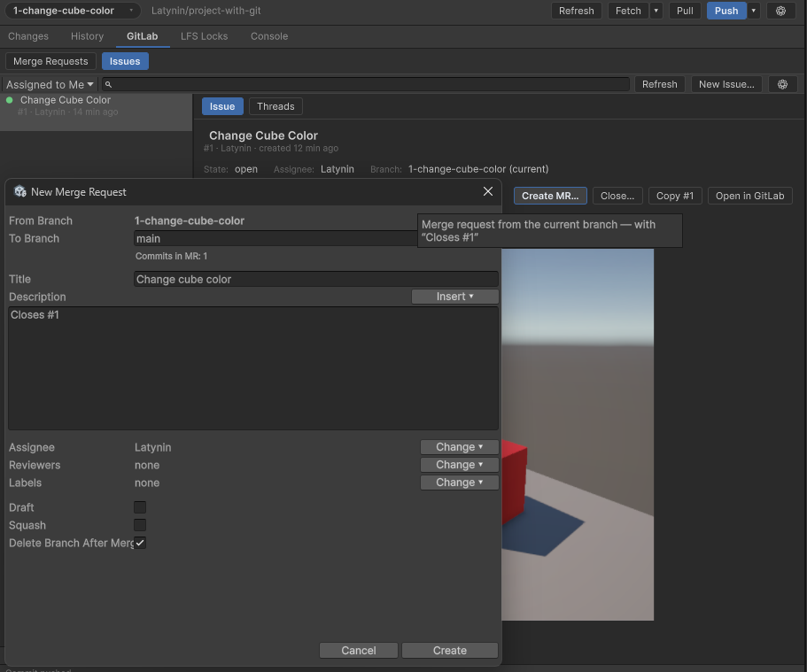</p>

<p align="center">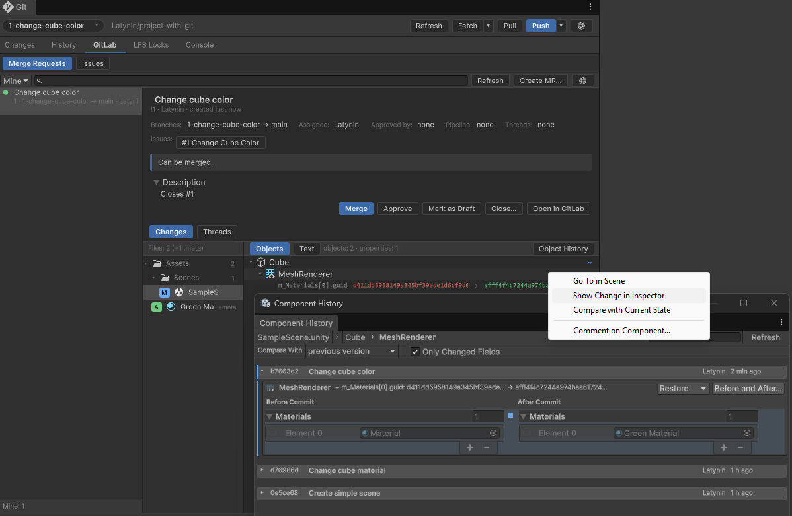</p>


### Ревью сцен, а не YAML

Изменения merge request'а выглядят так же, как локальные: дерево файлов, превью ассетов, сцены и префабы
объектами. Правой кнопкой по строке diff — комментарий к строке, по объекту или компоненту сцены —
комментарий к этому объекту. В GitLab он лежит у строки объекта в файле сцены и виден в браузере, а в
Unity снова находит объект по `fileID`, даже если файл с тех пор изменился.

<p align="center">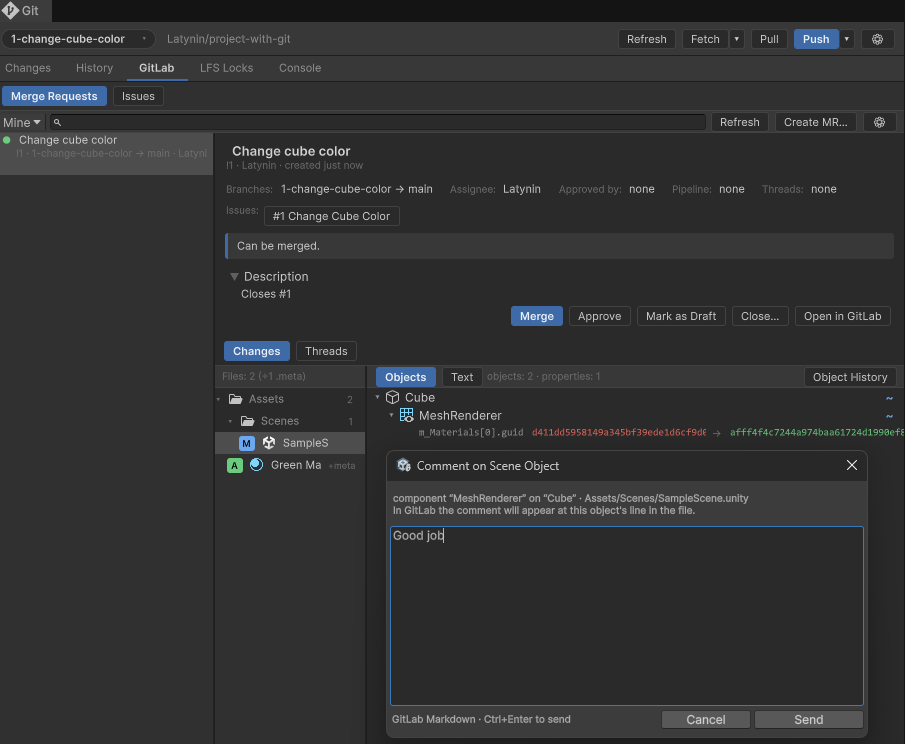</p>

<p align="center">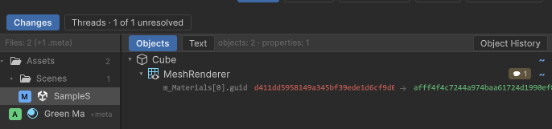</p>

Обсуждения — на той же вкладке: ответить, решить или открыть тред снова, перейти из треда к его строке
или объекту в изменениях.

<p align="center">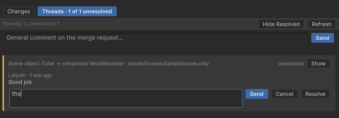</p>

## Установка

Нужны Unity 6000.0 или новее, `git` в PATH и, для локов, `git-lfs`.

В Unity: **Window → Package Manager → + → Add package from git URL…** и вставь:

```text
https://github.com/LatyninEugene/git-for-unity.git?path=/Packages/ru.lev.unity-git#v1.0.0-alpha.1
```

Или добавь в `Packages/manifest.json`:

```json
{
  "dependencies": {
    "ru.lev.unity-git": "https://github.com/LatyninEugene/git-for-unity.git?path=/Packages/ru.lev.unity-git#v1.0.0-alpha.1"
  }
}
```

Часть после `#` закрепляет релиз. Без неё ставится последний коммит основной ветки.
К каждому [релизу](https://github.com/LatyninEugene/git-for-unity/releases) приложен `.unitypackage`.

## С чего начать

1. Открой проект, лежащий в git-репозитории, и выбери **Window → Git**.
2. На вкладке «Изменения» отметь файлы, фрагменты или строки, напиши сообщение и закоммить. Pull, Push и Fetch — в шапке окна.
3. Выбери сцену, префаб или ассет — изменения видны объектами, в инспекторе или картинкой.
4. Правой кнопкой по объекту в иерархии → **Git → Object History**; по ассету в окне Project — история и локи.
5. Если проект на GitLab, включи интеграцию в **Project Settings → Git**.

Интерфейс на английском и русском, по умолчанию — на языке системы; сменить можно в **Preferences → Git**.

## Документация

- Полный справочник: [Русский](Packages/ru.lev.unity-git/README.ru.md) · [English](Packages/ru.lev.unity-git/README.md)
- [Список изменений](Packages/ru.lev.unity-git/CHANGELOG.md)

Это alpha: для своего кода предназначены только описанные API расширения превью и интерфейсы
интеграций, и они ещё могут измениться до 1.0.0.

## Сообщить о проблеме

В Unity: **Help → Git for Unity → Report a Problem…**. Сохранится zip с версиями, сводкой репозитория,
последними ошибками и командами git — токены и пароли удаляются, пути к файлам и адреса серверов можно
скрыть. Отчёт можно изучить самостоятельно или приложить к
[новому issue](https://github.com/LatyninEugene/git-for-unity/issues/new/choose).

Уязвимости: см. [SECURITY.md](SECURITY.md).

## Участие

Помощь приветствуется — исправления, переводы, превью для новых типов ассетов.
Как устроен репозиторий и как запускать тесты — в [CONTRIBUTING.md](CONTRIBUTING.md).

## Лицензия

[MIT](LICENSE)
